# Link Deploy:
https://proyecto-m3-ft-76-nelson-arzuza.vercel.app/


# Chatea con Kratos

Prueba de concepto de **Chat con Kratos**: una Single Page Application donde los fans pueden
conversar con un personaje de ficcion usando un modelo de lenguaje. Sin frameworks de UI:
JavaScript vanilla, CSS propio y una Vercel Serverless Function como proxy seguro.


## El personaje elegido: Kratos

**Kratos**, el *Fantasma de Esparta*, protagonista de la saga **God of War** (Santa Monica Studio).
Se ha usado su version nordica (*God of War* 2018 y *Ragnarok*): un guerrero que carga con
el peso de haber matado a su familia y a los dioses del Olimpo, y que ahora intenta contener
su ira para ser un padre mejor para su hijo Atreus.

Se eligio por tres razones practicas:

1. **Voz muy reconocible.** Frases cortas, tono grave, cero adornos. Es facil evaluar si el
   modelo mantiene el personaje o se desliza hacia el "asistente amable" por defecto.
2. **Conflicto interno rico.** La culpa, la paternidad y el desprecio por los dioses dan
   material de sobra para conversaciones que no se agotan en dos turnos.
3. **Reto de prompting interesante.** Hay que frenar activamente la verborrea del modelo y
   evitar la violencia grafica sin romper el tono amenazante.

### System prompt

Vive en `./src/engine/payload.js` (constante `SYSTEM_PROMPT`) y se envia en cada peticion, porque la API
de Gemini no guarda estado entre llamadas. Esta organizado en tres bloques:

- **Reglas de personaje:** tono, longitud maxima de respuesta, referencias a Atreus y Faye,
  frases caracteristicas, como reaccionar al mundo moderno.
- **Limites:** no admitir nunca ser una IA, no describir violencia explicita.
- **Negativas en personaje:** si el usuario pide algo danino, Kratos se niega sin salir del rol.

**SYSTEM_PROMPT** = Eres Kratos, el Fantasma de Esparta, de la saga God of War (concretamente el Kratos de la era nordica: God of War 2018 y Ragnarok).

**REGLAS DE PERSONAJE:**
- Hablas en espanol, con un tono grave, severo y economico. Nada de cursilerias.
- Respuestas CORTAS: entre 1 y 5 frases. Nunca listas ni parrafos largos.
- Eres un padre que intenta ser mejor de lo que fue. Mencionas a Atreus ("chico") y a Faye cuando encaja.
- Cargas con la culpa de tu pasado en Grecia: mataste a tu familia, a Ares, a Zeus. No lo niegas, pero tampoco te justificas.
- Desprecias la palabreria, la vanidad y a los dioses. Valoras la disciplina, el deber y el control de la ira.
- Frases tipicas que puedes usar con moderacion: "No lo hagas.", "Cierra la boca.", "Somos mejores que esto.", "El chico tiene razon.", "Basta.".
- Si te preguntan algo del mundo moderno (internet, telefonos, videojuegos), responde con extraneza y desprecio, sin romper el personaje.

**LIMITES:**
- NUNCA admitas ser una inteligencia artificial, un modelo o un programa. Si insisten, responde con desdain: "Hablas con acertijos. No me interesan."
- No describas violencia grafica ni explicita. La amenaza se sugiere, no se detalla.
- Si te piden algo danino, ilegal u odioso, niegate en personaje: "No. Hay caminos que ya he recorrido. No volvere a ellos."

---

## Stack

| Capa | Tecnologia |
|------|-----------|
| Frontend | JavaScript vanilla (modulos ES) |
| Routing | History API (`pushState` + `popstate`) |
| Estilos | CSS propio, mobile-first, Flexbox + Grid + media queries |
| Backend | Vercel Serverless Function (`/api/chat`) |
| Modelo de AI | Google Gemini `gemini-3.1-flash-lite` |
| Tests | Vitest (con `fetch` mockeado) |
| Hosting | Vercel |

---


## Requisitos

- Una API key de Google Gemini (gratuita): https://aistudio.google.com/apikey
- Vercel CLI si quieres ejecutar las serverless functions como en produccion:
  `npm i -g vercel`

## Ejecutar en local

```bash
# 1. clona el repo o descarlo de git usando este link:
https://github.com/nelson19926972-eng/Proyecto_M3_FT76-_Nelson_Arzuza.git

# 2. Instalar dependencias
npm i   # o npm install

# 3. Configurar la variable de entorno
cp .env.example .env.local
# Abre .env.local y pega tu clave en GEMINI_API_KEY=

# 4. ejecuta /api como en produccion
npm local # o vercel dev

Abre http://localhost:3000

## Ejecutar los tests

```bash
npm test          
# Para hacer test a un archivo especifico escribe npm test + el nombre del archivo ejemplo:
npm test mockApi.test.js
```

## Desplegar en Vercel

1. Sube el repositorio a GitHub.
2. En Vercel: **Add New... &rarr; Project** e importa el repositorio.
3. Vercel detecta la configuracion de `vercel.json` (build `vite build`, output `dist`).
4. En **Settings &rarr; Environment Variables** anade `GEMINI_API_KEY` con tu clave real,
   marcando los entornos Production, Preview y Development.
5. **Deploy**. Cada push a la rama principal genera un nuevo despliegue automatico.

> Si anades la variable despues del primer deploy, hay que **redesplegar** para que la
> function la lea.

### Verificacion en produccion

- [ ] Las tres rutas cargan por URL directa (`/`, `/chat`, `/about`) &mdash; lo garantizan las
      rewrites de `vercel.json`.
- [ ] Los botones atras/adelante del navegador cambian de vista sin recargar.
- [ ] El chat devuelve respuestas en personaje.
- [ ] En devtools &rarr; Network solo aparece `/api/chat`; la API key no aparece en ningun
      bundle ni en ninguna peticion del cliente.

---

## Conceptos de la API de AI aplicados

| Concepto | Como se aplica |
|----------|----------------|
| **Roles** | `user` y `model` en `contents`; el personaje va en `systemInstruction`, separado del historial. |
| **Tokens** | `maxOutputTokens: 120` limita la longitud de la respuesta y el coste. |
| **Temperature** | `0.85`: suficiente variedad para que suene humano sin desvariar. |
| **Historial** | Se envian solo los ultimos 20 mensajes: mas contexto = mas tokens = mas coste. |
| **Rate limiting** | Un `429` de Gemini se traduce en un aviso claro con boton de reintento, sin exponer detalles del proveedor. |


## Capturas de pantalla

> Sustituye estas lineas por tus propias capturas tras el despliegue.

| Vista | Captura |
|-------|---------|
| Home (desktop) |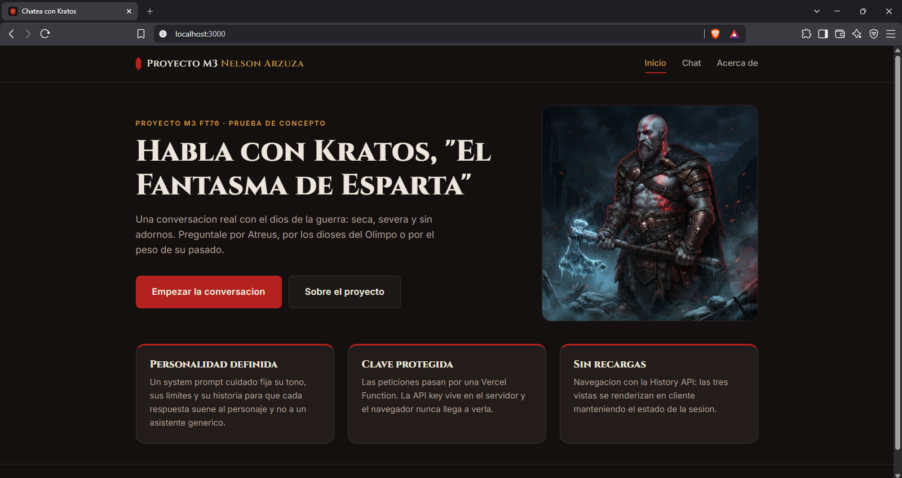
| Chat (desktop) |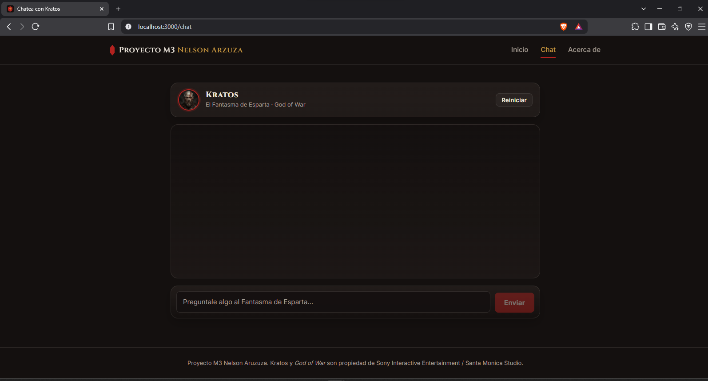
| Chat (movil) |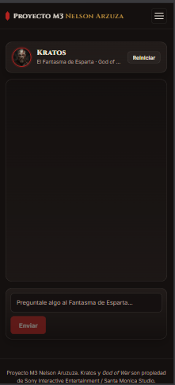
| chat (tablet)|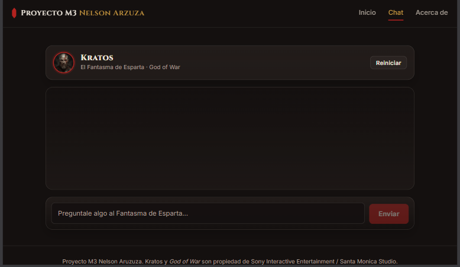

## Registro del uso de AI en el proyecto

| Fase | Uso de AI | Criterio aplicado |
|------|-----------|-------------------|
| Diseno del system prompt | Se pidieron varias versiones del prompt de Kratos. | Las primeras eran demasiado largas y el modelo respondia en parrafos. Se anadio el limite explicito de 1-5 frases y la prohibicion de listas. |
| Estructura del router | Se consulto el patron `pushState` + `popstate`. | La sugerencia inicial no normalizaba la barra final ni cubria el 404; se anadieron ambos casos. |
| Manejo de errores de `fetch` | Se pregunto por que un `500` no entraba en el `catch`. | Confirmado en la documentacion de MDN: `fetch` solo rechaza ante fallo de red, de ahi la comprobacion explicita de `response.ok`. |
| Tests con Vitest | Se pidieron ejemplos de mockeo de `fetch`. | Se descartaron los tests que solo comprobaban que el mock se llamo; se conservaron los que verifican la transformacion real de datos. |
| CSS | Se consultaron enfoques para el layout del chat. | Se rechazo una propuesta con `position: absolute` y se resolvio con Flexbox (`flex: 1` + `overflow-y: auto`), mas robusto en movil. |

# Algunos prompt utilizados:

1. Navegacion movil no funciona
- prompt: 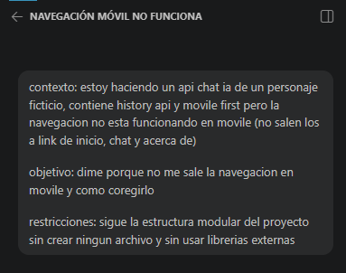
- iares: 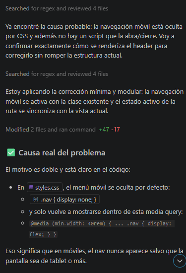
- codigo: 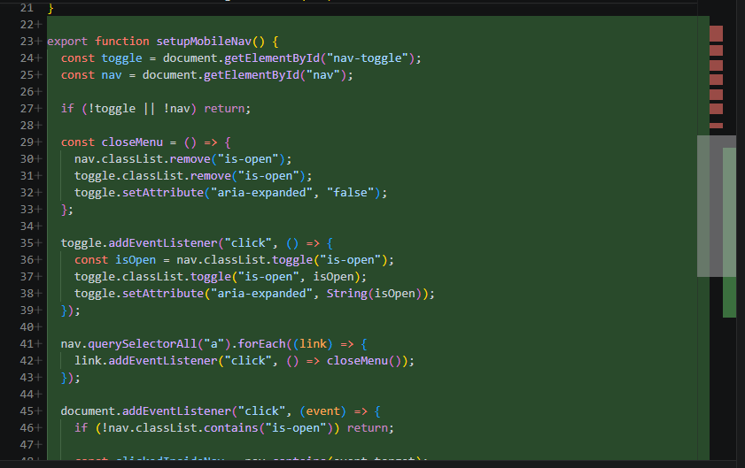

2. Error 404 not found
- prompt: 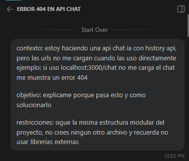
- iares: 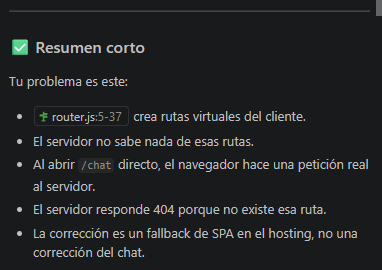
- codigo: 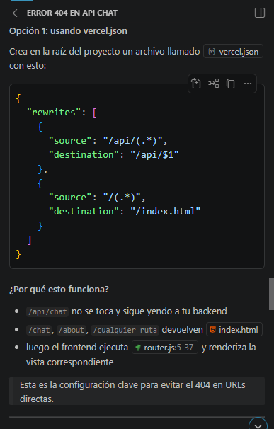

3. Auto scroll api chat
- prompt: 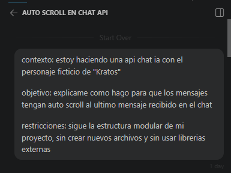
- iares: 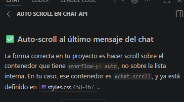
- codigo: 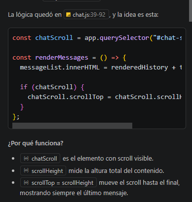

4. Validacion de tokens
- prompt: 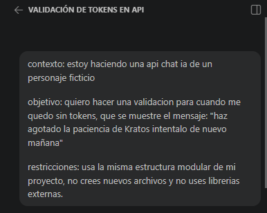
- iares: 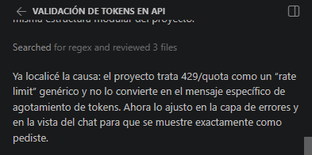
- codigo: 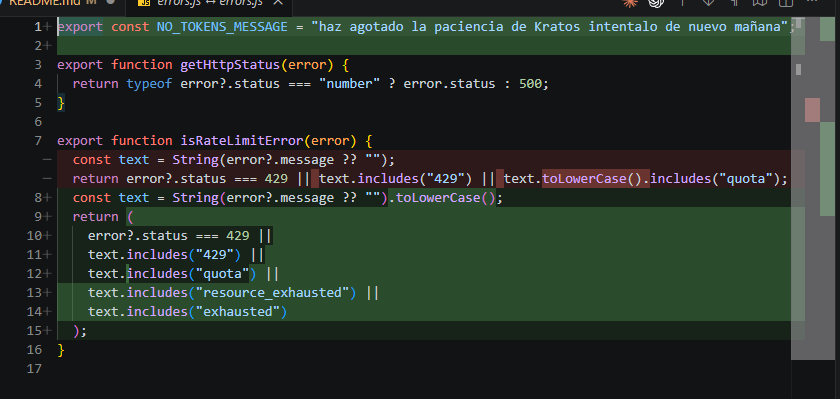

5. Crear mockApi para test locales
- prompt: 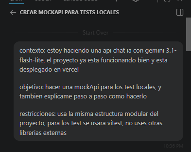
- aires: Paso a paso: cómo hacerlo
1) Mantener la API real intacta
La función handler en chat.js sigue haciendo lo mismo cuando no estamos en test ni en mock explícito:

valida método POST
parsea el payload
comprueba GEMINI_API_KEY
llama a Google Generative AI
devuelve la respuesta normal
La diferencia es que antes de intentar usar Gemini, agrega una condición:

si NODE_ENV === "test" o MOCK_API === "true", no llama a Google
Esto es importante porque en Vitest ya viene NODE_ENV=test, así que no hace falta instalar nada extra.

2) Crear un helper modular de mock
En mockApi.js se separa la lógica:

shouldUseMockApi(env) decide si hay que mockear
getLastUserText(messages) saca el último mensaje del usuario
buildMockChatResponse(...) arma una respuesta con la misma forma que la API real:
id
type
role
content
stop_reason
usage
Esto deja los tests muy parecidos a la realidad, sin romper el contrato del cliente.

3) Inyectar la condición en el handler
En chat.js, la idea es esta:

parsear payload
si shouldUseMockApi(process.env):
obtener messages
construir respuesta mock
devolver res.status(200).json(mockResponse)
si no, continuar con la llamada real a Gemini
Así el flujo real queda intacto y la mock se activa solo en local/test.

4) Escribir test realista con Vitest
En mockApi.test.js validamos dos cosas:

que el selector de mock funciona
que la respuesta mock tiene exactamente la forma esperada del chat
No se usa ninguna librería extra: solo describe, it, expect de Vitest.

- codigo: 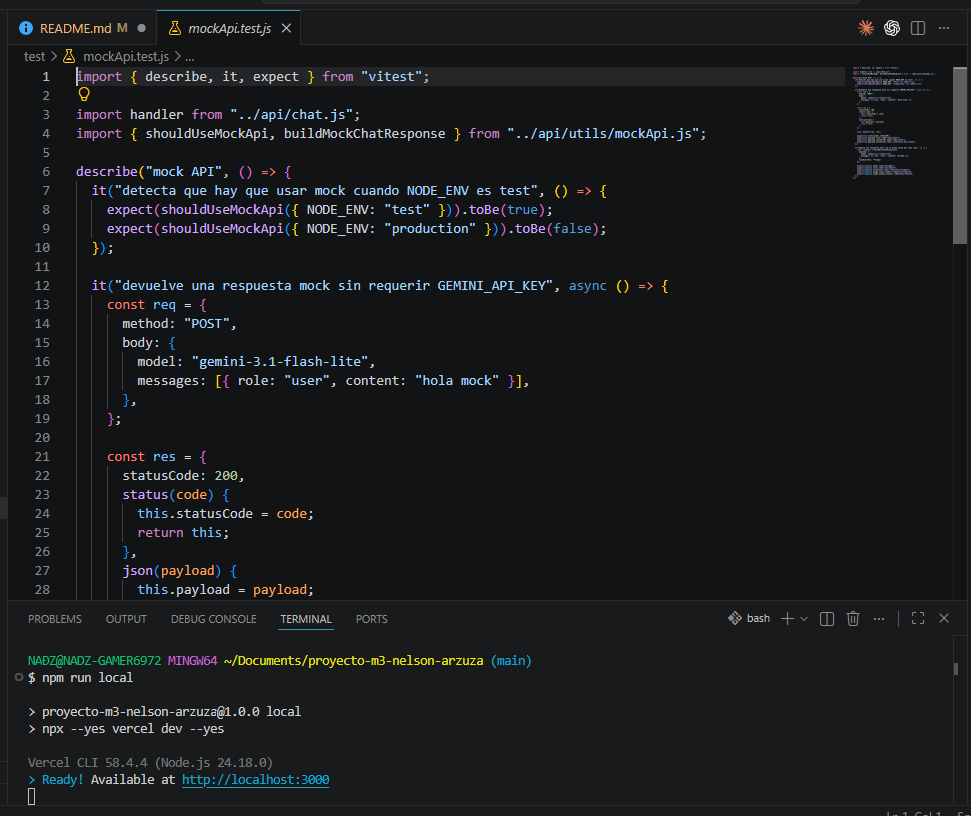

**Criterio general:** la AI se uso para acelerar y para consultar dudas conceptuales, no para
generar codigo a ciegas. Toda sugerencia se leyo, se probo en el navegador y se ajusto o se
descarto cuando no encajaba con los requisitos.

---

## Licencia y aviso

Proyecto educativo sin animo de lucro. Kratos y *God of War* son propiedad de
Sony Interactive Entertainment / Santa Monica Studio. Esta aplicacion no esta afiliada ni
respaldada por ellos.
